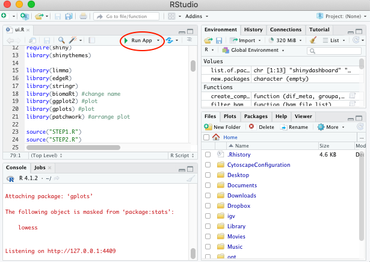
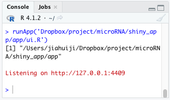
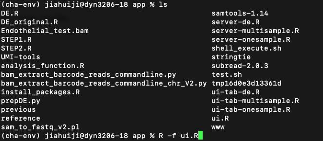
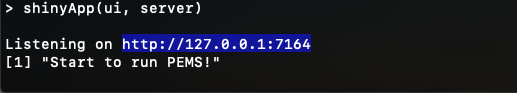

# PEMS

# How to run PEMS with RStudio:

**Step 1: Download app folder of the version you want**

PEMS app have one version for MacOS system and one version for linux system.

**Step 2: Download RStudio and load PEMS**

Download RStudio in your computer first. Go to app folder you downloaded and double click ui.R, ui.R will show in your RStudio. Click Runn App, PEMS shinyR interface will show. In the interface, if you click Open in Browser, it will be opened in browser.

**Step 3: Download required R packages and tools for analysis**

Once you click Run App butten, it will automatically install the R packages that you don't have for you. All required tools are downloaded under the app folder. You don't need to download them. 

If you would like to calculate UMI for your single sample run, you need to install UMI-tools (see download instruction here: https://umi-tools.readthedocs.io/en/latest/QUICK_START.html#step-1-install-umi-tools. You can download it by entering system("conda install -c bioconda umi_tools") or system("pip install umi_tools") in R Console in R studio. 

**Step 4: Run PEMS**

Now you can run PEMS using the PEMS interface for single sample run, multi-sample run, differential expression analysis and power estimation.

# How to run PEMS with R command line:

**Step 1: Download app folder of the version you want**

PEMS app have one version for MacOS system and one version for linux system.

**Step 2: Download required packages**

**To run PEMS, you need:**

python3

python2.7

R >= 3.6.1

pysam python module (you can install in by conda install pysam or pip install pysam https://pysam.readthedocs.io/en/latest/installation.html)

**You need tools:**

samtools-1.14 (http://www.htslib.org/download/)

strintie (http://ccb.jhu.edu/software/stringtie/index.shtml)

UMI_tools (https://umi-tools.readthedocs.io/en/latest/INSTALL.html)

subread-2.0.3 (http://subread.sourceforge.net)

**or**

You can load the conda environment file pems_env.yml by conda env create -f pems_env.yml  All required tools, python and R have already been installed there.

**You also need to install R package by running the code in install_packages.R:**

list.of.packages=c("shinydashboard","shinyjs","shinyBS","shinycssloaders","shiny","shinythemes","limma","edgeR","stringr","biomaRt","ggplot2","gplots","patchwork")

new.packages=list.of.packages[!(list.of.packages %in% installed.packages()[,"Package"])]

if(length(new.packages)) install.packages(new.packages)

**Step 3: Use R command line**

Open your terminal and go to the app folder you downloaded. Enter R -f ui.R command. After running, you will see a http request. Copy the http request to browser, then the PEMS interface is loaded.

# How to run PEMS with command line in linux:
If you would like to run PEMS use linux command line, go to PEMS_command_version folder and use the .sh file there to run PEMS.

