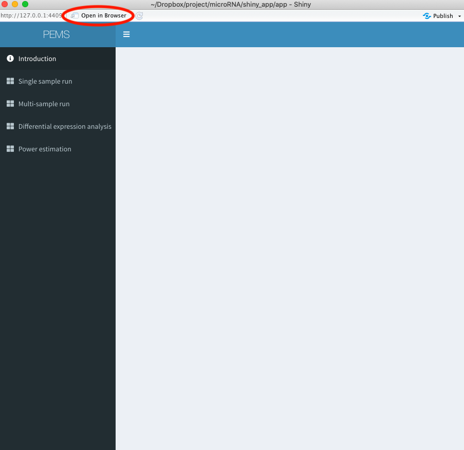

# PEMS

**How to run PEMS:** 

**Step 1: Download app folder of the version you want**
PEMS app have one version for MacOS system and one version for linux system.

**Step 2: Download RStudio and load PEMS**
Download RStudio in your computer first. Go to app folder you downloaded and double click ui.R, ui.R will show in your RStudio. Click Runn App, PEMS shinyR interface will show. In the interface, if you click Open in Browser, it will be opened in browser.

