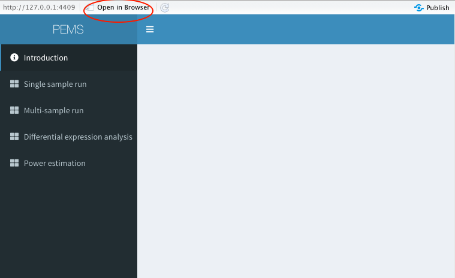
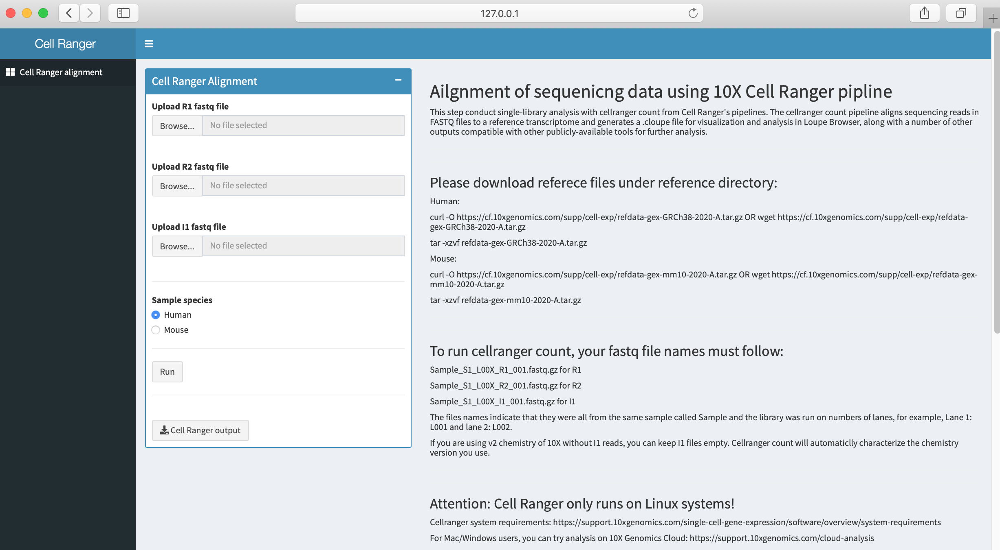

# PPMS

# 1. How to run PPMS with RStudio:

**Step 1: Download app folder of the version you want**

PPMS app have one version for MacOS system and one version for linux system. You can download them in Releases.

**Step 2: Download RStudio and load PPMS**

Download RStudio in your computer first. Go to app folder you downloaded and double click ui.R, ui.R will show in your RStudio. Click Runn App, PPMS shinyR interface will show. In the interface, if you click Open in Browser, it will be opened in browser.

**Step 3: Download required R packages and tools for analysis**

Once you click Run App butten, it will automatically install the R packages that you don't have for you. All required tools are downloaded under the app folder. You don't need to download them. 

If you would like to calculate UMI for your single sample run, you need to install UMI-tools (see download instruction here: https://umi-tools.readthedocs.io/en/latest/QUICK_START.html#step-1-install-umi-tools. You can download it by entering system("conda install -c bioconda umi_tools") or system("pip install umi_tools") in R Console in R studio. 

**Step 4: Run PPMS**

Now you can run PPMS using the PPMS interface for single sample run, multi-sample run, differential expression analysis and power estimation.

# 2. How to run PPMS with R command line:

**Step 1: Download app folder of the version you want**

PPMS app have one version for MacOS system and one version for linux system. You can download them in Releases.

**Step 2: Download required packages**

**To run PPMS, you need:**

python3

python2.7

R >= 3.6.1

pysam python module (you can install in by conda install pysam or pip install pysam https://pysam.readthedocs.io/en/latest/installation.html)

**You need tools:**

samtools-1.14 (http://www.htslib.org/download/)

stringtie (http://ccb.jhu.edu/software/stringtie/index.shtml)

UMI_tools (https://umi-tools.readthedocs.io/en/latest/INSTALL.html)

subread-2.0.3 (http://subread.sourceforge.net)

**or**

You can load the **conda environment file ppms_env.yml under conda_env folder** by conda env create -f ppms_env.yml  All required tools, python and R have already been installed there.

**You also need to install R package by running the code in install_packages.R:**

list.of.packages=c("shinydashboard","shinyjs","shinyBS","shinycssloaders","shiny","shinythemes","limma","edgeR","stringr","biomaRt","ggplot2","gplots","patchwork","png","plyr")

new.packages=list.of.packages[!(list.of.packages %in% installed.packages()[,"Package"])]

if(length(new.packages)) install.packages(new.packages)

new.packages=list.of.packages[!(list.of.packages %in% installed.packages()[,"Package"])]

if (!require("BiocManager", quietly = TRUE))
    install.packages("BiocManager")
    
if(length(new.packages)) BiocManager::install(new.packages)

**Step 3: Use R command line**

Open your terminal and go to the app directory you downloaded. Enter R -f ui.R command. After running, you will see a http request. Copy the http request to browser, then the PPMS interface is loaded.

# 3. How to run PPMS with command line in linux:
If you would like to run PPMS use linux command line, go to PPMS_command_version folder and use the .sh file there to run PPMS.

**To run PPMS with command line in linux, you also need:**

python3

python2.7

R >= 3.6.1

pysam python module (you can install in by conda install pysam or pip install pysam https://pysam.readthedocs.io/en/latest/installation.html)

**You need tools:**

samtools-1.14 (http://www.htslib.org/download/)

strintie (http://ccb.jhu.edu/software/stringtie/index.shtml)

UMI_tools (https://umi-tools.readthedocs.io/en/latest/INSTALL.html)

subread-2.0.3 (http://subread.sourceforge.net)

**or**

You can load the **conda environment file ppms_env.yml under conda_env folder** by conda env create -f ppms_env_linux.yml or ppms_env_macos.yml All required tools, python and R have already been installed there.

# 4. How to run Cell Ranger pipline for alignment with R command line in linux system:

**Step 1: Download app_cellranger folder in release**

**Step 2: Download required packages**

**Cell Ranger pipline for conducting alignment of sequencing fastq files can only be run in linux system. To use the user interface of Cell Ranger pipline with shinyR interface through linux system, you need:**

python3

R >= 3.6.1

**You need to install R package by running the code in install_packages.R to run shinyR:**

list.of.packages=c("shinydashboard","shinyjs","shinyBS","shinycssloaders","shiny","shinythemes")
new.packages=list.of.packages[!(list.of.packages %in% installed.packages()[,"Package"])]
if(length(new.packages)) install.packages(new.packages)

**You also need to download the reference files as instructed:**

refdata-gex-GRCh38-2020-A

refdata-gex-mm10-2020-A

**Step 3: Use R command line**

Open your terminal and go to the app_cellranger directory you downloaded. Enter R -f ui.R command. After running, you will see a http request. Copy the http request to browser, then the interface for Cell Ranger pipline is loaded.

**OR**

Directly use commnad line in linux:

export PATH=/path_to_cellranger_folder/cellranger-7.0.0:$PATH

GENOME=/path_to_reference_file/refdata-gex-GRCh38-2020-A
FQ=/path_to_fastq_folder/fastq_folder

cellranger count --id=$S --fastqs=$FQ --sample=$S --transcriptome=$GENOME --include-introns TRUE

Please refer Cell Ranger website for more details: https://support.10xgenomics.com/single-cell-gene-expression/software/pipelines/latest/using/tutorial_ct

**Step 4: Cell type annotation**

Cell Ranger is able to align sequencing fastq files and generate ouput of count matrix. Output count matrix can be further loaded in Seurat R package (https://satijalab.org/seurat/index.html) for QC, analysis and single-cell RNA-seq data exploration. Seurat aims to enable users to identify and interpret sources of heterogeneity from single-cell transcriptomic measurements. You can further refer to Seurat tutorials (https://satijalab.org/seurat/articles/pbmc3k_tutorial.html).

**(1) Quality control and select cells for further analysis**

Seurat allows exploration of QC metrics and cell filtering based on user-defined criteria. Noramlly, we consider:

***The number of unique genes detected in each cell*** (Low-quality cells or empty droplets will often have very few genes; Cell doublets or multiplets may exhibit an aberrantly high gene count)

***The total number of molecules detected within a cell*** (correlates strongly with unique genes)

***The percentage of reads that map to the mitochondrial genome*** (Low-quality / dying cells often exhibit extensive mitochondrial contamination)

**(2) Cluster cells**
Principal component analysis (PCA) is firstly conducted on the normalized and scaled data. 

Seurat further applies a graph-based clustering approach to cluster cells based on their PCA scores to overcome the extensive technical noise in any single feature for scRNA-seq data. Each PC essentially representing a 'metafeature' that combines information across a correlated feature set. The top principal components therefore represent a robust compression of the dataset. 

Seurat further provides several non-linear dimensional reduction techniques, such as tSNE and UMAP, to visualize and explore your single cell dataset.

**(3) Assign cell type identify to clusters**
Through expression of 'marker genes' (i.e., genes that are specifically expressed in a known cell type), it is able to identify and label individual cells or cell clusters as those of known cell types. Please refer to Clarke et al. (2021) (https://www.nature.com/articles/s41596-021-00534-0#citeas) for detailed methods.

